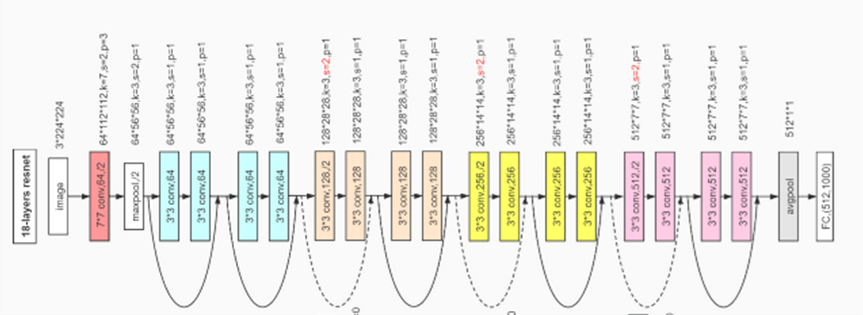

# Indoor Positioning and Navigation Using Video Retrieval

## Overview
This project introduces a cutting-edge approach to indoor positioning and navigation using video retrieval. It is designed to accurately identify user locations within indoor settings using state-of-the-art deep learning techniques, tailored for environments where GPS is ineffective.

## Key Features
- **High Precision Location Identification**: Utilizes a **ResNet50 model** trained with **PyTorch** to predict user locations from images with over 90% accuracy, ensuring reliable navigation support.
- **Efficient Processing**: Achieves a minimal computation time of 70ms, facilitating real-time user location updates.
- **Extensive Database**: Features a **streamlined MySQL database** that holds attributes of over 100 Points of Interest (POIs) and 50,000+ data entries, enabling robust **training and operational** support for the deep learning models.

## Technology Stack
- **ResNet50 and PyTorch**: The core of our visual recognition system, providing efficient and accurate image-based location prediction.
- **MySQL Database**: Manages a vast dataset of indoor POIs and their attributes, optimized for high performance and scalability.
- **Python**: Serves as the backbone for integrating the database, deep learning models, and the application logic.

## Usage
1. Launch the application.
2. Capture indoor environment images using your device camera.
3. The system will process the images and guide you to your desired location.

## Results
### Resnet Network

Resnet18 Deep Learning Network.

### Model Performance
Our model demonstrates exceptional performance in indoor positioning accuracy and efficiency. Below is a summary of the results obtained:

| Metric | Value  |
| ------ |--------|
| **Accuracy** | 98.09% |
| **Computation Time** | ~70ms  |

These results highlight the model's capability to provide highly accurate positioning with minimal computation time, making it significantly more efficient than traditional methods like SIFT.

## Contribution
We welcome contributions to improve the project. 

## License
This project is distributed under the MIT License. See the `LICENSE` file for more details.
